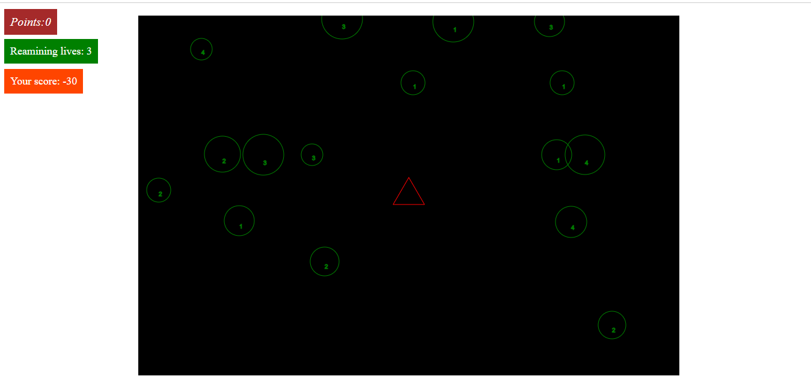

# 🚀 Asteroids Game


> 🕹️ A simple browser - based Asteroids game built in JavaScript!

This is a classic style **Asteroids Game** implemented in **JavaScript**, **HTML**, and a bit of **CSS** for visuals.  
Fly your spaceship, shoot asteroids, score points, and climb the high score board! 🎯

---

## 🎮 Controls

| Action             | Key |
|--------------------|-----|
| Move Forward       | ⬆️ Arrow Up |
| Move Backward      | ⬇️ Arrow Down |
| Move Left          | ⬅️ Arrow Left |
| Move Right         | ➡️ Arrow Right |
| Rotate Left        | `Z` |
| Rotate Right       | `C` |
| Fire Rocket        | `X` |

---

## 🧠 Game Rules

- 💥 Destroy asteroids to gain points.
- 🎯 Every **50 points** = +1 extra life.
- 💔 Losing a life **subtracts 15 points** from your score.
- 🏆 The top **5 high scores** are saved using the **Web Storage API** (in your browser's local storage).

---

## 🧰 Tech Stack

- **JavaScript** – Game logic & controls
- **HTML** – Canvas & structure
- **CSS** – Basic styling
- **Web Storage API** – High score persistence

---

# 📷 App Capture



## 🚀 How to Play

1. **Clone or download** the repository:
   ```bash
   git clone https://github.com/kristianp24/Asteroids-Game.git
2. Open index.html in your browser.

3. Play directly – no server or install needed!

